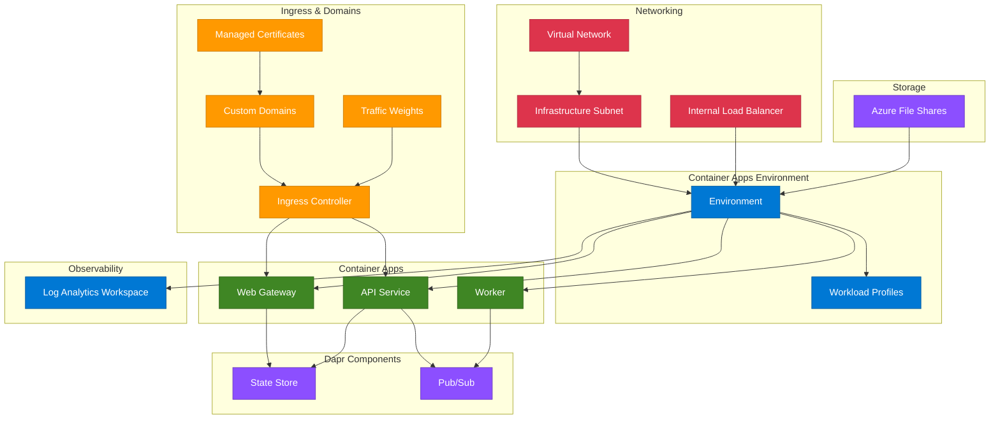

# terraform-azure-container-apps

Production-ready Terraform module for deploying Azure Container Apps with environments, Dapr components, custom domains, scaling rules, managed certificates, Log Analytics integration, and VNet injection.

## Architecture



## Usage

```hcl
module "container_apps" {
  source = "path/to/terraform-azure-container-apps"

  resource_group_name = "rg-apps"
  location            = "East US"
  environment_name    = "cae-prod-001"

  container_apps = {
    "api" = {
      template = {
        containers = [{
          name   = "api"
          image  = "mcr.microsoft.com/azuredocs/containerapps-helloworld:latest"
          cpu    = 0.25
          memory = "0.5Gi"
        }]
      }
      ingress = {
        target_port = 80
      }
    }
  }
}
```

## Examples

- [Basic](examples/basic/main.tf) - Single container app with external ingress
- [Advanced](examples/advanced/main.tf) - Multiple apps with Dapr, health probes, and secrets
- [Complete](examples/complete/main.tf) - Full deployment with VNet injection, workload profiles, storage, and traffic splitting

## Requirements

| Name | Version |
|------|---------|
| [terraform](https://www.terraform.io/) | >= 1.5.0 |
| [azurerm](https://registry.terraform.io/providers/hashicorp/azurerm/latest/docs) | >= 3.80.0 |

## Resources

| Name | Type | Documentation |
|------|------|---------------|
| [azurerm_container_app_environment](https://registry.terraform.io/providers/hashicorp/azurerm/latest/docs/resources/container_app_environment) | resource | Container Apps Environment |
| [azurerm_container_app](https://registry.terraform.io/providers/hashicorp/azurerm/latest/docs/resources/container_app) | resource | Container App |
| [azurerm_container_app_environment_dapr_component](https://registry.terraform.io/providers/hashicorp/azurerm/latest/docs/resources/container_app_environment_dapr_component) | resource | Dapr components |
| [azurerm_container_app_environment_storage](https://registry.terraform.io/providers/hashicorp/azurerm/latest/docs/resources/container_app_environment_storage) | resource | Environment storage |
| [azurerm_container_app_custom_domain](https://registry.terraform.io/providers/hashicorp/azurerm/latest/docs/resources/container_app_custom_domain) | resource | Custom domains |
| [azurerm_log_analytics_workspace](https://registry.terraform.io/providers/hashicorp/azurerm/latest/docs/resources/log_analytics_workspace) | resource | Log Analytics |
| [azurerm_resource_group](https://registry.terraform.io/providers/hashicorp/azurerm/latest/docs/data-sources/resource_group) | data source | Resource group lookup |

## Inputs

| Name | Description | Type | Default | Required |
|------|-------------|------|---------|----------|
| resource_group_name | Name of the resource group | `string` | n/a | yes |
| location | Azure region | `string` | n/a | yes |
| environment_name | Container Apps Environment name | `string` | n/a | yes |
| log_analytics_workspace_id | Existing Log Analytics workspace ID | `string` | `null` | no |
| create_log_analytics_workspace | Create a new Log Analytics workspace | `bool` | `true` | no |
| log_analytics_workspace_name | Name for new Log Analytics workspace | `string` | `""` | no |
| log_analytics_sku | Log Analytics SKU | `string` | `"PerGB2018"` | no |
| log_analytics_retention_days | Log retention in days | `number` | `30` | no |
| infrastructure_subnet_id | Subnet ID for VNet injection | `string` | `null` | no |
| internal_load_balancer_enabled | Use internal load balancer only | `bool` | `false` | no |
| zone_redundancy_enabled | Enable zone redundancy | `bool` | `false` | no |
| workload_profiles | Workload profile configurations | `map(object)` | `{}` | no |
| container_apps | Container app definitions | `map(object)` | `{}` | no |
| dapr_components | Dapr component definitions | `map(object)` | `{}` | no |
| custom_domains | Custom domain configurations | `map(object)` | `{}` | no |
| managed_certificates | Managed certificate configurations | `map(object)` | `{}` | no |
| environment_storages | Storage mount configurations | `map(object)` | `{}` | no |
| tags | Tags for all resources | `map(string)` | `{}` | no |

## Outputs

| Name | Description |
|------|-------------|
| environment_id | Resource ID of the Container Apps Environment |
| environment_name | Name of the Container Apps Environment |
| environment_default_domain | Default domain of the environment |
| environment_static_ip_address | Static IP address of the environment |
| log_analytics_workspace_id | Resource ID of the Log Analytics workspace |
| container_app_ids | Map of app names to resource IDs |
| container_app_fqdns | Map of app names to FQDNs |
| container_app_outbound_ip_addresses | Map of app names to outbound IPs |
| container_app_latest_revision_names | Map of app names to latest revision names |
| dapr_component_ids | Map of Dapr component names to resource IDs |

## License

MIT License - see [LICENSE](LICENSE) for details.
